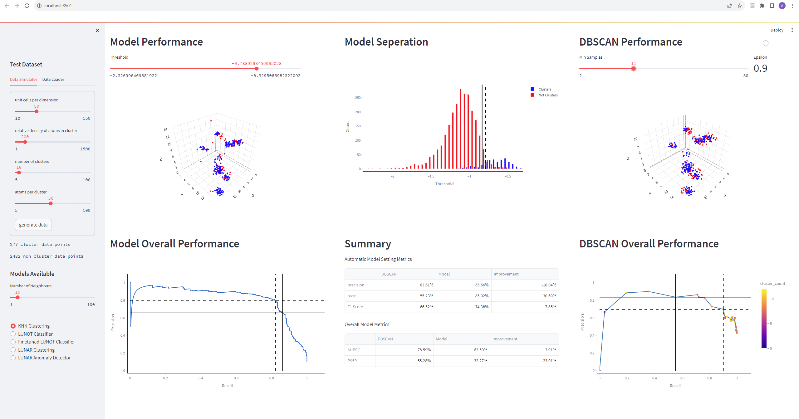

# ODIASC

Outlier Detection for Identifying Alloy Solute Clusters. Python benchmark and web dashboard.

Supporting code for [Testing Outlier Detection Algorithms for Identifying Early-Stage Solute Clusters in Atom Probe Tomography](https://arxiv.org/abs/2402.13734) paper.

## Method

Ferrite Atom Probe Tomography (APT) data is simulated by creating a perfect BCC lattice. Solute clusters are then introduced by randomly adding a denser group of labelled atoms around the assigned cluster centres. The noise and lost datapoints associated with APT are then added.

Several key statistical techniques are then used to try to detect the cluster atoms as precicely as possible.
| Technique | Working Principle |
|---|---|
| DBSCAN | a group of atoms form a cluster if there are greater than N atoms within a distance D of any given atom |
| KNN | an atom is in a cluster if the average distance to the N nearest atoms is below D |
| *LUNOT | a graph neural network pretrained on labelled simulated data. It detects whether an atom is in a cluster based on the distances to its 50 nearest neighbours |
| *LUNAR | a graph neural network trained to differentiate normal unclustered atom data from random noise. It can then detect atoms in clusters by recognising that they look different to unclustered data |

*These models return a "cluster score" for each atom. An automatic thresholder is used to seperate the non cluster atoms in the output distrubution from the cluster atoms.

The web dashboard then tests any of the given models on a custom simluated dataset and displays key performance indicators. 

The benchmark runs a longer series of tests in parallel across a variety of simulated samples. It returns key performance statistics for all models across all samples as a csv file. 

## Installation

1.  Clone the repository onto your local machine.

        git clone https://github.com/AyhamSaffar/ODIASC.git

2.  Install dependancies.

    It is recomended that you create a dedicated conda enviroment.

        conda create --name ODIASC_env --file conda_env.txt

    You could download the required dependancies into you main conda enviroment with the following command. This however may clash with the libraries already installed.

        conda install --file conda_env.txt

3.  Run.

    The web dashboard can be launched in your default browser with the following command:

        streamlit run "Model Evaluation Tool.py"

    The benchmark can by started by simplying running the .py file:

        python "Sensitivity Data Generator.py"

## Usage

Different cluster detecting models can be added to the dashboard and benchmark by adding to the utils/models.py file. These models must follow the abstract base class template defined at the top of this file and be appended to the models list at the end of the file.

If an added model outputs a continuous scoring label, a different automatic thresholder than the one currently used may work best. This can be tested using the "Model Output Thresholding.ipynb" notebook. The selected pythresh thresholder can then be used in the dashboard by changing the THRESHOLDER constant in the corresponding .py file. To use this thresholder in the benchmark however, a new measurement must be manually added to the corresponding .py file.

The analysis folder contains lots of the benchmark data used in the paper. When running further benchmarks, it is important to change the DATA_PATH constant at the top of the corresponding file to avoid overwriting any of the existing data.

Extra real datasets can be loaded into the dashboard by adding to the "Real Datasets" folder. These must be headerless .csv files with four columns corresponding to x, y, z, and mass to charge ratio (mcr) respectively.

Custom mcr to element mappings can also be used. This is done by adding the .rrng file to the "APT Range Files" folder and changing the APT_RANGE_FILE_PATH constant at the top of the "Model Evaluation Tool.py" file.

The "LUNOT Hyperparameter Search.py" and "LUNOT Training.ipynb" files were used to create the LUNOT model. These could be adapted for creating different neural network based models.

## Roadmap

There are currently no plans to update this repository.

## Authors and Acknowledgement

Written by Ayham Al-Saffar with guidance from Ryan Stroud and funding from an Ironmonger's grant.

Completed as part of a wider scope of work as detailed in [our paper](https://arxiv.org/abs/2402.13734).